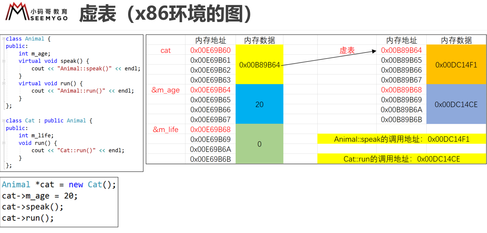

#  C++

## 1、函数重载（Overload）
### 规则
- [x] 函数名相同
- [x] 参数的个数不同、参数类型不同、参数顺序不同

###  **注意**
- [x] 返回值类型与函数重载无关
- [x] 调用函数时，实参的隐式类型转换可能产生二义性

### **本质**
- [x] 采用了name mangling 或者叫name decoration技术

✔️ C++编译器默认会对符号名(函数名、变量名)进行改编，修饰

✔️重载是会生成多个不同的函数名，不同编译器（MSVC g++）有不同的生成规则

✔️通过IDA打开【VS_Release_禁止优化】可以看到

例一:

```
diplayer_int
void diplayer(int a){
cout << "diplayer(int a) << " << a << endl;
}
diplayer_double
void diplayer(double a){
cout << "diplayer(double a) << " << a << endl;
}
diplayer_long
void diplayer(long a){
cout << "diplayer(long a) << " << a << endl;
}
```

例二:

```
int add(int a,double b){
return a + b;
}
int add(double a,int b){
return a + b;
}
```

## 2.extern "C"
C 与C++ 混合开发

被 extern “C” 修饰的代码会按照C语言的方式去编译

- C++ 在调用C语言API时，需要使用extern “C”修饰C语言函数声明

```
extern "C"{
 
}
```
### 默认参数

 C++ 允许函数设置默认参数，在调用时可以根据情况省略实参。规则如下:
- [x] 默认参数只能按照右到左顺序
- [x] 如果函数同时有声明、实现、默认参数只能放在函数声明中 
- [x]  默认参数的值可以是常量、全局符号（全局变量、函数名）
- [x] 函数重载、默认参数可能产生冲突、二义性（建议优先选择默认参数）

例一：
```
void func(int a,int b, int c = 20){

}
func(10,20);
```
例二：
```
int age = 70;
void func(int a,int b, int c = age){

}

```

例三:

```
void display(){
    cout << "display" << endl;
}
void display(int a = 10,int b = 20){
    cout << "a is" << a << endl;
    cout << "a is" << b << endl;
}

// 产生二义性
display();

```


指向函数的指针
```
void test(){

}

void (*funcPtr)() = test;
funcPtr();
```
## 3.内联函数（inline function）

使用`inline`修饰函数的声明或者实现，可以使其变成内联函数
- [x]建议声明和实现都增加`inline`修饰

### 特点
- [x] 编译器会将函数调用直接展开为函数体代码
- [x] 可以减少函数调用的开销
- [x] 会增大代码体积

### 注意
- [x] 尽量不要内联代码超过10行的函数
- [x] 有些函数即使声明为`inline`,也不一定会被编译器内联，比如递归函数

- 代码量不是很多
- 函数调用频率很高

### 内联函数和宏

- [x] 内联函数和宏都可以减少函数调用的开销
- [x] 对比宏，内联函数多了语法检测和函数特性

### 思考以下代码的区别
- `#define sum(x) (x+x)`
- `inline int sum(int x) {return x+x}`
- `int a = 10; sum(a++);`

### #pragma once

- 我们经常使用 `#ifndef`、`#define`、`#endif`来防止头文件的内容被重复包含

- `#pragma once` 可以防止整个文件的内容被重复包含

### 区别
- `#ifndef`、`#define`、`#endif` 受C\C++标准的支持，不受编译器的任何限制

- 有些编译器不支持 `#pragma once`，兼容性不好

- `#ifndef`、`#define`、`#endif` 可以针对文件中的部分代码，而 `#pragma once`只能针对整个文件


## 4.引用（Reference）

- 在C语言中，使用指针（Pointer）可以间接获取、改变某个变量的值
- 在C++中，使用引用（Reference）可以起到跟指针类似的功能

```
int a = 20;
// rage就是一个引用/定义了一个引用
// 定义了一个引用，相当于变量的别名
int &rage = age;
```
### 注意点
- 引用相当于是变量的的别名（基本数据类型、枚举、结构体、类、指针、数组等，都可以有引用）
- 对引用做计算，就是对引用所指的变量做计算
- 在定义的时候必须初始化，一旦指向了某个变量，就不可以再改变，“从一而终”
- 可以利用引用初始化另一个引用，相当于某个变量的多个命名
- 不存在【引用的引用，指向引用的指针，引用数组】

**引用存在的价值之一：比指针更安全，函数返回值可以被赋值** 

```
int age = 10;
int &rAge = age;
//1.不存在引用的引用
int &&rAge2 = rAge;
//2.不存在指向引用的指针
int &*p = &rAge;
//3.不存在引用数组
int &array[4]
```


1.指针引用
```
int a = 10;
int b = 20;

int *p = &a;
int *&rp = p;
rp = &b;
*p = 30;

a = 10, b = 30
```

2.数组引用
```
int array[] = { 10, 20, 30};
int (&rArray)[3] = array;


int *a[4];//指针数组
int (*b)[4];//指向数组的指针

```

指针数组

int *a [2];


使用场景

值交换
```
void swap(int &a,int &b){
    int temp = a;
    a = b;
    b = temp;
}

int v1 = 10;
int v2 = 20;
swap(v1,v2);

```

### const

 const 是常量的意思，被修饰的变量不可以更改

- 如果修饰的是类、结构体（的指针）其成员变量不可修改

```
struct Student{
  int age
}

Student stu = {20};

// 指针
//不能修改age的值
const Student *pStu = &stu;
pStu->age = 30;

```

例子：
以下5个指针分别是什么含义
```
int age = 10;
// *p0 是常量 , p0 不是常量
const int *p0 = &age;
//同上
int const *p1 = &age;
// p2是常量 ，*p2不是常量
int * const p2= &age;
// p3是常量，*p3是常量
const int *const p3 = &age;
// p4是常量，*p4是常量
int const * const p4 = &age;
```
上面的指针问题可以用以下结论来解决:
- **const修饰的是其右边的内容**

```
int height = 20;
Int age = 10;
Int *p0 = &age;

*p0 = 20; // 修改指针指向的空间值
P0 = &height; // 修改p0 的指向
```

### 常引用（Const Reference）

引用可以被`const`修饰，这样就无法通过引用修改数据了，可以称为常引用

- [x] `const`必须写在&符号的左边，才算是常引用

#### `const`引用的特点
- [x] 可以指向临时数据（常量、表达式、函数返回值等）
- [x] 可以指向不同类型的数据
- [x] 作为函数参数时（此规则也适用于const指针）

✔️ 可以接受const 和非 const实参（非const引用，只能接收非const实参）

✔️可以跟非`const`引用构成重载


引用本质就是指针
```
int age = 10;
// 1、 rAge的指向不能改
// int & const rAge = age;

rAge = 20； 正确

// 2、不能通过引用修改所指向的内容 ❎
int const &rAge = age;

rAge = 20；错误

```

```
// 1、常量
int age = 10;
const int &rAge = 40;

// 2、表达式
int a = 10;
int b = 30;
 
const int &rAge = a + b;

// 3、函数返回值

int func(){
    return 10;  
}
const int &rAge = func();

// 构成重载
int sum(int &a, int &b){
    return a + b;
}
int sum(const int &a,const int &b){
    return a + b; 
}
```

#### 当常引用指向了不同类型的数据时，会产生临时变量，即引用指向并不是初始化时的那个变量

例子:
```

int age = 10;
const long &rAge = age;
age = 30;

初始汇编
mov dword ptr [ebp-0Ch],0Ah
mov eax,dword ptr [ebp-0Ch]
mov dword ptr [ebp-24h],eax
lea ecx,[ebp-24h]
mov dword ptr [ebp-18h],ecx
mov dword ptr [ebp-0Ch],1Eh

解析:
int age = 10;
//int temp = age; 临时变量
mov dword ptr [ebp-0Ch],0Ah

eax = 10
mov eax,dword ptr [ebp-0Ch]
int temp = age;
mov dword ptr [ebp-24h],eax
ecx = &temp
lea ecx,[ebp-24h]
&rAge = ebp-24h
mov dword ptr [ebp-18h],ecx

age = 30
mov dword ptr [ebp-0Ch],1Eh

```

### 数组引用
常见的两种写法

```
int array[] = { 10, 20, 30};
int *p = array;
int * &p = array; ❌  p 引用可以被修改的


int array[] = { 10, 20, 30};
int (&ref1)[3] = array;
int * const &ref2 = array;
```
### 表达式

C++ 的有些表达式是可以被赋值的

```
int a = 10
int b = 30

(a = b) = 50

```


### 引用本质
- [x] 引用的本质就是指针，只是编译器削弱了它的功能，所以引用就是弱化了的指针
- [x] 一个引用占用一个指针的大小


### 汇编

|项目|AT&T|Intel|说明|
|:---:|:---:|:---:|:---:|
|寄存器命名|%eax|eax|Intel不带%|
|操作数顺序|movl %eax,%edx|mov edx,eax|将eax的值赋值给edx|
|常数\立即数|movl $3,%eax movl $0x10,%eax|mov eax,3 mov eax,0x10|将3赋值给eax，将0x10赋值给eax|
|jmp指令|jmp *%edx \ jmp *0x4001002  \jmp *(%eax)|jmp edx jmp 0x4001002 jmp [eax]|在AT&T的jmp地址前面要加星号 *|
|操作数长度|movl %eax, %edx movb $0x10, %al leaw 0x10(%dx), %ax|mov edx, eax mov al, 0x10 lea ax, [dx + 0x10]|b = byte (8-bit) s = short (16-bit integer or 32-bit floating point) w = word (16-bit) l = long (32-bit integer or 64-bit floating point) q = quad (64 bit) t = ten bytes (80-bit floating point)|


#### 寄存器


#### 汇编指令
- mov dest, src
- [ 地址值 ]

中括号[ ]里面放的都是内存地址 word是2字节，dword是4字节(double word)，qword是8字节(quad word)
- call 函数地址
- lea dest, [ 地址值 ]

将地址值赋值给dest，类似于dest = 地址值
- ret
- xor op1, op2

op1 = op1 ^ op2
- add op1, op2
- sub op1, op2
- inc op
- dec op

- jmp 内存地址 // 无条件跳转
- jz
- jn

跳转到某个内存地址去执行代码

例子:
```
&a == rbp+4
int a = 5;
mov dword ptr [rbp+4],5

&p == rbp+28h
int *p = &a;
lea rax,[rbp+4]
mov qword ptr [rbp+28h],rax

*p = 6;
mov rax,qword ptr [rbp+28h] // = rbp+4
mov dword ptr [rax],6

```

## 面向对象常见知识点

- 类
- 对象
- 成员变量、成员函数
- 封装、继承、多态
- ....

## 5.类\对象

C++中可以使用`struct、class`来定义一个类

### `struct`和`class`的区别
- [x] `struct` 的默认成员权限是`public`
- [x] `class` 的默认成员权限是`private`

### 对象的内存布局
- 类中多个成员变量在内存中如何布局  

#### 1、代码段
用于存放代码

#### 2、数据段（全局区）
用于存放全局变量

1.在C\C++中定义在函数外边的就是全局变量

2.全局变量的特点：在程序运行过程中都存在

#### 3、栈空间
- 每调用一个函数，就会给它分配一段连续的栈空间，等函数调用完成之后会自动回收这段栈空间
- 自动分配和回收
#### 4、堆空间
- 在程序运行过程中，为了能够自由控制内存的生命周期、大小、会经常使用怼空间的内存

- 堆空间 申请\释放

malloc \ free

new \ delete

new [] \ delete []

##### 注意

- 申请堆空间成功后，会返回那一段内存空间的地址
- 申请和释放必须1对1的关系，不然可能会存在内存泄露

```
// 使用一个字节保存 10
char *p = (char *)malloc(4);
*p = 10;

```

```
int *p = new int;
delete p;

// 创建一个数组 ： 10个元素
int *p = (int *)malloc(sizeof(int)*10);
p[0]
delete p 

int *p = new int[10];
delete[] p;

```

```
int *p = (int *)malloc(4);
//memory set
// 从p开始的4个字节,每个字节都存放0
memset(p, 0, 4);


int *p1 = new int; //*p1未初始化
int *p2 = new int(); //*p2初始化为0
int *p3 = new int(5); //*p3初始化为5
int *p4 = new int[4]; // 4个数组元素未初始化
int *p5 = new int[4](); // 4个数组元素初始化为 0 
int *p6 = new int[4]{}; // 4个数组元素都初始化为0
int *p7 = new int[4]{ 0 }; // 4个数组元素初始化为0
int *p8 = new int[4]{ 5 }; //  数组首元素初始化为5

```


### this

- this 是指向当前对象的指针
- 对象在调用成员函数的时候，会自动传入当前对象的内存地址


例子:
```
struct Person{
    int m_id;
    int m_age;
    int m_height;
    void display(){
        cout << this.m_id << endl;
        cout << this.m_age << endl;
        cout << this.m_height << endl;
    }
};

    Person person;
    person.m_id = 10;
    person.m_age = 20;
    person.m_height = 30;
    
    //取出pPerson中存储的地址值,将person的地址默认为person.m_id的地址
    Person *pPerson = (Person *)&person.m_id;
    
    // mov eax,dword ptr [pPerson]
    // mov dword ptr [eax],40
    // mov dword ptr [eax+4],50
    
    pPerson->m_id = 40;
    pPerson->m_age = 50;
    person.display();
    
    10，40，50
```
编译器操作内存和寄存器


C++ 编码规范

变量名规范参考:
- [x]全局变量: g_
- [x]成员变量: m_
- [x]静态变量: s_

## 6.封装

成员变量私有化，提供公共的`getter`和`setter`给外界去访问成员变量

```
struct Person {
    private:
    int m_age;

    public:
    void setAge(int age){
    this->m_age = age;
    }
    int getAge(){
    return this->m_age;
    }
}
```

## 7.构造函数
- 构造函数（也叫构造器），在对象创建的时候自动调用，一般用于完成对象的初始化工作

#### 特点
- 函数名与类同名，无返回值(void都不能写),可以有参数，可以重载，可以有多个构造函数
- 一旦自定义了构造函数，必须用其中一个自定义的构造函数来初始化对象

**构造函数调用构造函数 ---- 初始化列表**

◼注意 
- 通过malloc分配的对象不会调用构造函数

 一个广为流传的、很多教程\书籍都推崇的错误结论:
 - 默认情况下，编译器会为每一个类生成空的无参的构造函数 （❌）
 - 正确理解:在某些特定的情况下，编译器才会为类生成空的无参的构造函数 ✓ (哪些特定的情况?以后再提)

例子:
```
全局区
Person g_person1; // Person()
Person g_person2(); // 这是一个函数申明，函数名叫g_person2，无参，返回值类型为 Person
Person g_person3(10); // Person(int age)

栈空间
Person person1; // Person()
Person person2(); // 函数申明，函数名叫person2，无参，返回值类型是Person
Person person3（20）// Person(int age)

堆空间
Person *p1 = new Person; // Person()
Person *p2 = new Person();// Person()
Person *p3 = new Person(30);// Person(int age)
```


## 8.析构函数(Destructor)

 - 析构函数，也叫析构器，在对象销毁的时候自动调用，一般用于完成对象的清理工作

◼特点
- 函数名以~开头，与类同名，无返回值，无参，不可以重载，有且只有一个析构函数


◼注意
- 通过malloc分配的对象free的时候不会调用构造函数


### 声明和实现分离

```
// 声明
class Person{
int m_age;
public:
void setAge(int age);
int getAge();
Person();
~Person();
};

// 实现
// :: 是域运算符
Person::Person(){

}
Person::~Person(){

}
void Person::setAge(int age){
this->m_age = age;
}
int Person::getAge(){
return this->m_age;
}

```


## 9.命名空间

- 命名空间可以用来避免命名冲突
```
using namespace xx
using xx::
```

- 命名空间不影响内存才能布局

### 1.命名空间的嵌套

- 有个默认的全局命名空间，我们创建的命名空间默认都嵌套在它里面

默认的命名空间，没有名字
::test（）

### 2.命名空间的合并

namespace MJ{
  int g_age;
}
namespace MJ{
int g_height;
}

namespace MJ{
  int g_age;
  int g_height;
}

```
namespace FX{
  namespace SS{
    int m_age;
    class Person{
    
    }
  } 
}

```
### 10.继承

- 继承、可以让子类拥有父类的所有成员（变量\函数）

```
struct Person{
    int m_age;
    void run(){
    
    }
};

struct Student : Person{
    int m_no;
};

struct GoodStudent: Student{
    int m_money;
}

```

**对象内存布局:父类成员变量在低地址**


#### 成员访问权限

成员访问权限、继承方式有3种

- public:公共的，任何地方都可以访问(struct默认)

- protected:子类内部、当前类内部可以访问 

- prvate:私有的，只有当前类内部可以访问(class默认)


◼ 子类内部访问父类成员的权限，是以下2项中权限最小的那个 

- 成员本身权限

- 上一级父类的继承方式

◼ 开发中用的最多的继承方式是public，这样能保留父类原来的成员访问权限

◼ 访问权限不影响对象的内存布局


```
struct Person{
public:
int m_age;
void run(){

}
};

// 以private的方式 继承父类成员属性和方法,只允许当前类访问，不允许子类访问
struct Student : private Person{
int m_no;
};

struct GoodStudent: Student{
int m_money;
void study(){
}
};
```


### 11、初始化列表

```
struct Person {
int m_age;
int m_height;

Person(){

}
// 初始化列表 :m_age(age),m_height(height)
Person(int age,int height) :m_age(age),m_height(height){

}
};

```

◼特点 
- 一种便捷的初始化成员变量的方式 
- 只能用在构造函数中
- 初始化顺序只跟成员变量的声明顺序有关
   - `Person(int age,int height) :m_age(age),m_height(height)`
   - `Person(int age,int height) :m_height(height),m_age(age)`
都是先初始化m_age

#### 构造函数的互相调用必须使用初始化列表

```
// 无参调用有参
Person() :Person(0,0) { } 
Person(int age, int height): m_age(age),m_height(height) { }

```


```
class Person{
    int m_age;
    int m_height;
public:
// 默认参数只能写在函数的声明中
Person(int age = 0, int height = 0);

}
// 构造函数的初始化列表只能写在实现中
Person::Person(int age,int height):m_age(age),m_height(height){

}

```
**如果函数的声明和实现是分离的**
- 初始化列表只能写在函数的实现中
- 默认参数只能写在函数的声明中


### 12、父类的构造函数

- ◼子类的构造函数会默认的调用父类的无参的构造函数

默认会先调用父类的构造函数，然后调用子类的构造函数

- ◼ 如果子类的构造函数显式地调用了父类的有参构造函数，就不会再去默认调用父类的无参构造函数
- ◼ 如果父类缺少无参构造函数，子类的构造函数必须显式调用父类的有参构造函数

### 13、父类指针、子类指针

-  父类指针可以指向子类对象，是安全的，开发中经常用到(继承方式必须是public)

- 子类指针指向父类对象是不安全的

```
class Person{
public:
int m_age;
};

class Student:public Person{
public:
int m_score;
};

// 父类可以指向子类
Person *p  = new Student();
```

### 14、多态

◼ 默认情况下，编译器只会根据指针类型调用对应的函数，不存在多态

◼ 多态是面向对象非常重要的一个特性
- 同一操作作用于不同的对象，可以有不同的解释，产生不同的执行结果 
- 在运行时，可以识别出真正的对象类型，调用对应子类中的函数

◼ 多态的要素 

- 子类重写父类的成员函数(override) 
- 父类指针指向子类对象 
- 利用父类指针调用重写的成员函数


不同对象对同一事件的不同响应

#### 实现多态

- C++中的多态通过虚函数(virtual function) 来实现

- 只要在父类中声明为虚函数，子类中重写的函数也自动变成虚函数(也就是说子类中可以省略virtual关键字)

- 多态实现的本质:
 在对象首个成员变量前面插入一个虚表的地址，当调用对象方法时候会查找该对象地址取出对应的虚表地址，找到对应方法的调用地址，然后调用该子类对应的函数


#### 调用父类的成员函数实现（重写父类方法类似super）
```
class Animal {
public:
    virtual void speak(){
     cout << "Animal::speak" << endl;
    }
};
 
class Cat: public Animal{
public:
    void speak(){
        //先执行父类的成员函数
        Animal::speak();
        //再执行子类
        cout << "Cat::speak" << endl;
    }
} 

```


### 15.虚表

- 虚函数的实现原理是虚表，这个虚表里面存储着最终需要调用的虚函数地址，这个虚表也叫虚函数表

- 所有的Cat对象(不管在全局区、栈、堆)共用同一份虚表，父类和子类指向不同的虚表


个人理解：
父类中声明`virtual`,父类对象和子类对象在内存中会多一个虚表的地址，不论子类是否重写该虚函数




#### 虚析构函数

- 含有虚函数的类，应该将析构函数声明为虚函数(虚析构函数) 
- delete父类指针时，才会调用子类的析构函数，保证析构的完整性


### 16.纯虚函数

- 纯虚函数:没有函数体且初始化为0的虚函数，用来定义接口规范
```
class Animal {
public:
    virtual void speak() = 0;
    virtual void run() = 0;
}
```

抽象类(Abstract Class) 
- 含有纯虚函数的类，不可以实例化(不可以创建对象)
- 抽象类也可以包含非纯虚函数
- 如果父类是抽象类，子类没有完全实现纯虚函数，那么这个子类依然是抽象类

### 17、多继承
C++允许一个类可以有多个父类(不建议使用，会增加程序设计复杂度)

多继承有一个好处的用途: 
- 一个类实现多个接口（Java）
- 一个类遵守多份协议（OC）
- 一个类继承多个抽象类（C++）

#### 多继承体系下的构造函数调用

#### 多继承-虚函数

- 如果子类继承的多个父类都有虚函数，那么子类对象就会产生对应的多张虚表

#### 同名函数

#### 同名成员变量

#### 菱形继承

◼ 菱形继承带来的问题
- 最底下子类从基类继承的成员变量冗余、重复
- 最底下子类无法访问基类的成员，有二义性


###  18、虚继承

- ◼ 虚继承可以解决菱形继承带来的问题 
- ◼ Person类被称为虚基类


